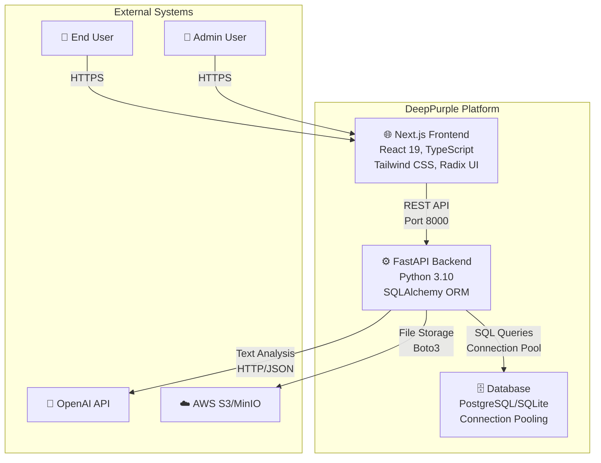
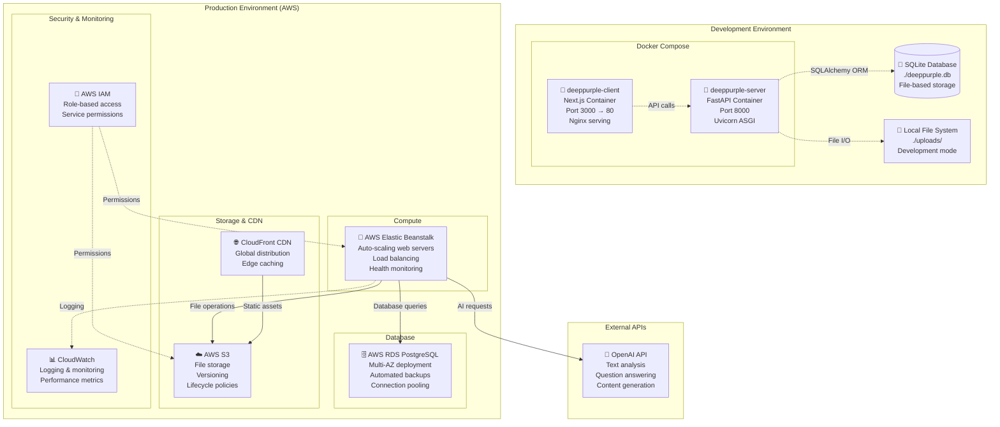
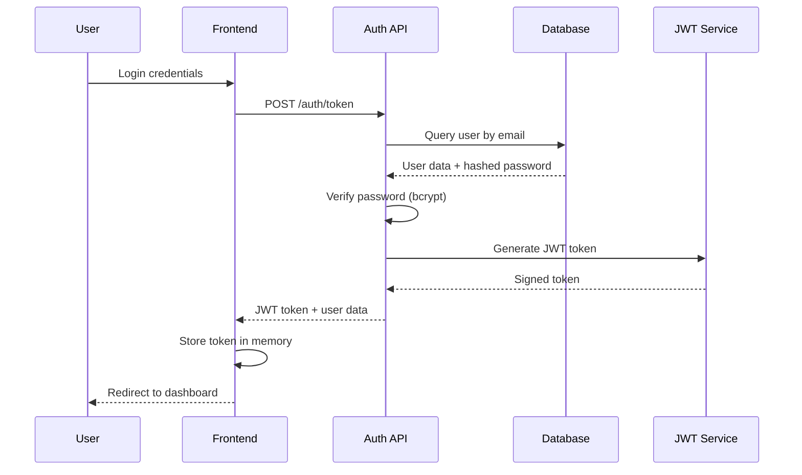
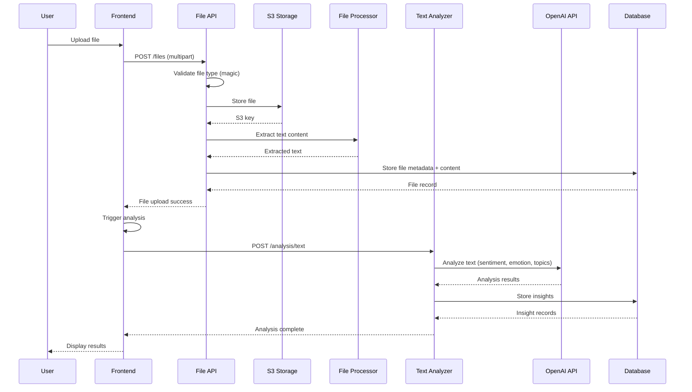
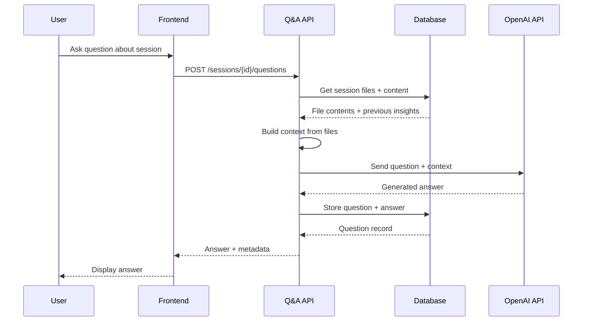

# DeepPurple Application Architecture Diagram

## Overview

This document provides a comprehensive architecture diagram for the DeepPurple text analysis platform, showing the complete tech stack from frontend to database with cloud services integration.

## System Architecture

### High-Level Architecture (C4 Model - System Context)



### Container Diagram (Detailed Services)

```mermaid
graph TB
    subgraph "Client Tier - Port 3000"
        NextJS[🌐 Next.js 15.3.2<br/>- React 19 Components<br/>- Server Side Rendering<br/>- TypeScript<br/>- Tailwind CSS + Radix UI]

        subgraph "Frontend Features"
            Auth[🔐 Authentication Pages]
            Dashboard[📊 Dashboard & Analytics]
            Sessions[📝 Session Management]
            Profile[👤 User Profile]
            FileUpload[📁 File Upload Interface]
        end
    end

    subgraph "API Gateway Tier - Port 8000"
        FastAPI[⚙️ FastAPI Application<br/>- Uvicorn ASGI Server<br/>- CORS Middleware<br/>- JWT Authentication<br/>- Pydantic Validation]

        subgraph "API Endpoints"
            AuthAPI[🔑 /auth - Login/Signup]
            UserAPI[👤 /users - Profile Management]
            SessionAPI[📝 /sessions - Session CRUD]
            FileAPI[📁 /files - File Operations]
            AnalysisAPI[🧠 /analysis - Text Analysis]
            AdminAPI[⚖️ /admin - Admin Functions]
        end
    end

    subgraph "Business Logic Tier"
        subgraph "Core Services"
            AuthService[🔐 Authentication Service<br/>- JWT Token Management<br/>- Password Hashing<br/>- Admin Authorization]

            TextAnalyzer[🧠 Text Analysis Engine<br/>- Sentiment Analysis<br/>- Emotion Detection<br/>- Topic Extraction<br/>- Text Summarization]

            FileProcessor[📄 File Processing Service<br/>- PDF Parser (PyPDF2)<br/>- CSV Parser (Pandas)<br/>- TXT Parser<br/>- Content Extraction]

            S3Manager[☁️ Storage Manager<br/>- File Upload/Download<br/>- Presigned URLs<br/>- Local Development Mode]
        end
    end

    subgraph "Data Tier"
        Database[(🗄️ Database<br/>PostgreSQL/SQLite<br/>Connection Pooling<br/>Auto-migration)]

        subgraph "Database Tables"
            Users[👥 users<br/>- Authentication<br/>- Profile Data<br/>- User Tiers]
            SessionsTable[📝 sessions<br/>- Analysis Sessions<br/>- User Ownership]
            Files[📁 files<br/>- File Metadata<br/>- S3 Keys]
            FileContents[📄 file_contents<br/>- Extracted Text<br/>- Processing Status]
            Insights[💡 insights<br/>- Analysis Results<br/>- JSON Data]
            Questions[❓ questions<br/>- User Queries<br/>- AI Responses]
        end
    end

    subgraph "External Services"
        OpenAI[🤖 OpenAI API<br/>- GPT Models<br/>- Text Analysis<br/>- Q&A Generation]

        Storage[☁️ File Storage<br/>AWS S3 (Production)<br/>MinIO (Development)<br/>Local FS (Fallback)]
    end

    %% Client Connections
    NextJS -->|HTTP/HTTPS<br/>API Calls| FastAPI
    Auth -->|JWT Tokens| AuthAPI
    Dashboard -->|Session Data| SessionAPI
    Sessions -->|CRUD Operations| SessionAPI
    Profile -->|User Updates| UserAPI
    FileUpload -->|Multipart Form| FileAPI

    %% API to Services
    AuthAPI -->|User Validation| AuthService
    SessionAPI -->|Business Logic| TextAnalyzer
    FileAPI -->|File Processing| FileProcessor
    AnalysisAPI -->|AI Processing| TextAnalyzer
    AdminAPI -->|Admin Logic| AuthService

    %% Service Interactions
    AuthService -->|User Queries| Database
    TextAnalyzer -->|AI Requests| OpenAI
    TextAnalyzer -->|Store Results| Database
    FileProcessor -->|Store Files| Storage
    FileProcessor -->|Store Metadata| Database
    S3Manager -->|File Operations| Storage

    %% Database Relationships
    Users ||--o{ SessionsTable : owns
    SessionsTable ||--o{ Files : contains
    Files ||--|| FileContents : has
    SessionsTable ||--o{ Insights : generates
    SessionsTable ||--o{ Questions : asks
```

### Deployment Architecture



## Technology Stack Breakdown

### Frontend Stack

- **Framework**: Next.js 15.3.2 with React 19
- **Language**: TypeScript 5+
- **Styling**: Tailwind CSS 4 with PostCSS
- **UI Components**: Radix UI primitives
- **Icons**: Lucide React
- **Forms**: React Hook Form with Zod validation
- **Charts**: Recharts for data visualization
- **HTTP Client**: Axios for API communication
- **Build Tool**: Turbopack (Next.js built-in)

### Backend Stack

- **Framework**: FastAPI 0.104.0
- **Language**: Python 3.10
- **ASGI Server**: Uvicorn 0.23.2
- **ORM**: SQLAlchemy 2.0.23
- **Authentication**: JWT with python-jose
- **Password Hashing**: bcrypt + passlib
- **Validation**: Pydantic 2.0+
- **File Processing**: PyPDF2, pandas, python-magic
- **AI Integration**: OpenAI API, LangChain
- **Cloud SDK**: boto3 for AWS services

### Database & Storage

- **Primary Database**: PostgreSQL (production), SQLite (development)
- **Connection Management**: SQLAlchemy connection pooling
- **File Storage**: AWS S3 (production), MinIO (development), Local FS (fallback)
- **Caching**: In-memory token blacklisting (Redis recommended for production)

### Infrastructure & DevOps

- **Containerization**: Docker with multi-stage builds
- **Orchestration**: Docker Compose (development), AWS ECS (production)
- **CI/CD**: GitHub Actions (assumed)
- **Monitoring**: AWS CloudWatch, application logging
- **Security**: AWS IAM, environment-based configuration

## Data Flow Diagrams

### User Authentication Flow



### File Upload & Analysis Flow



### Question Answering Flow



## Security Architecture

### Authentication & Authorization

- **JWT Tokens**: HS256 algorithm with configurable expiration
- **Password Security**: bcrypt hashing with salt
- **Role-Based Access**: Admin vs regular user permissions
- **Token Blacklisting**: In-memory revocation (logout)
- **Session Isolation**: Users can only access their own data

### Data Protection

- **SQL Injection Prevention**: SQLAlchemy ORM with parameterized queries
- **File Upload Security**: MIME type validation, size limits
- **CORS Configuration**: Environment-specific origin restrictions
- **Input Validation**: Pydantic models with type checking
- **Error Handling**: Sanitized error messages

### Infrastructure Security

- **Environment Variables**: Sensitive data in .env files
- **AWS IAM**: Least privilege access policies
- **Database Encryption**: RDS encryption at rest
- **S3 Security**: Bucket policies and presigned URLs
- **Network Security**: VPC configuration (production)

## Performance Considerations

### Database Optimization

- **Connection Pooling**: 5 base connections, 10 overflow
- **Query Optimization**: Proper indexing on foreign keys
- **Connection Management**: Automatic cleanup and recycling
- **Migration Strategy**: Alembic for schema changes

### File Processing

- **Streaming Uploads**: Handle large files efficiently
- **Async Processing**: Non-blocking file operations
- **Content Caching**: Extracted text stored in database
- **Storage Tiers**: S3 lifecycle policies for cost optimization

### API Performance

- **Dependency Injection**: Efficient database session management
- **Response Caching**: Static asset optimization
- **Pagination**: Limit query results for large datasets
- **Error Handling**: Graceful degradation and retry logic

## Monitoring & Observability

### Application Logging

- **Structured Logging**: JSON format for CloudWatch
- **Log Levels**: Debug, Info, Warning, Error, Critical
- **Request Tracing**: API endpoint performance tracking
- **Error Tracking**: Exception capture and notification

### Metrics & Alerting

- **Response Time**: API endpoint latency monitoring
- **Error Rates**: 4xx/5xx response tracking
- **Database Performance**: Connection pool utilization
- **Storage Usage**: S3 bucket size and costs

### Health Checks

- **Container Health**: Docker healthcheck endpoints
- **Database Connectivity**: Connection pool status
- **External Dependencies**: OpenAI API availability
- **Storage Access**: S3 bucket accessibility

## Development Workflow

### Local Development

1. **Environment Setup**: Docker Compose with hot reload
2. **Database**: SQLite for simplicity, automatic migrations
3. **File Storage**: Local filesystem with uploads directory
4. **API Testing**: FastAPI automatic OpenAPI documentation

### Production Deployment

1. **Container Build**: Multi-stage Docker builds
2. **Infrastructure**: AWS ECS with RDS and S3
3. **Environment Variables**: Secure configuration management
4. **Database Migration**: Automated schema updates

This architecture provides a scalable, secure, and maintainable foundation for the DeepPurple text analysis platform, with clear separation of concerns and robust error handling throughout the system.
