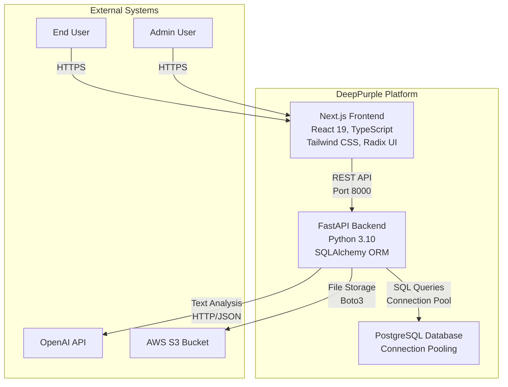
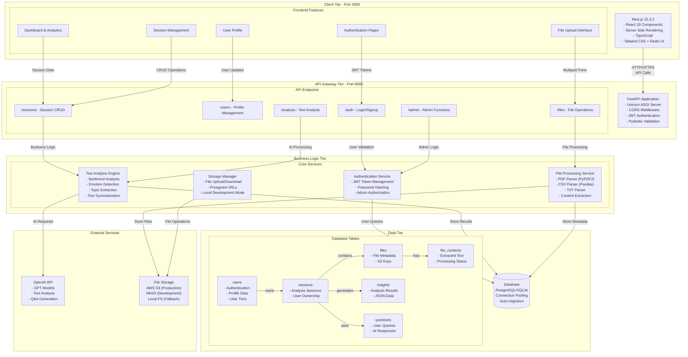
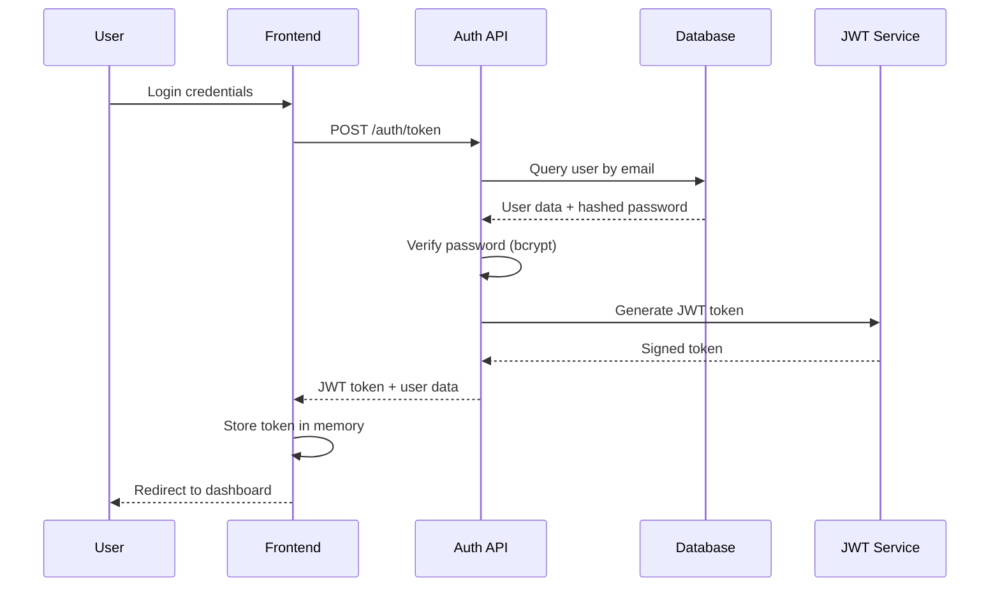
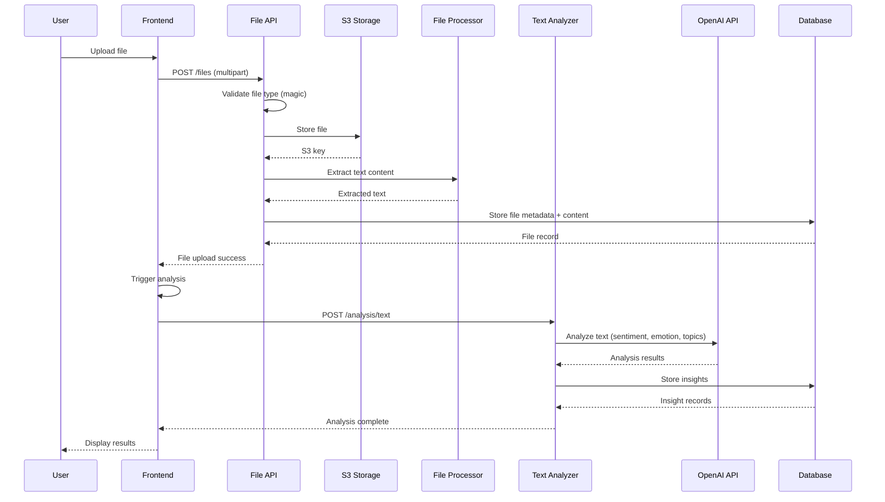
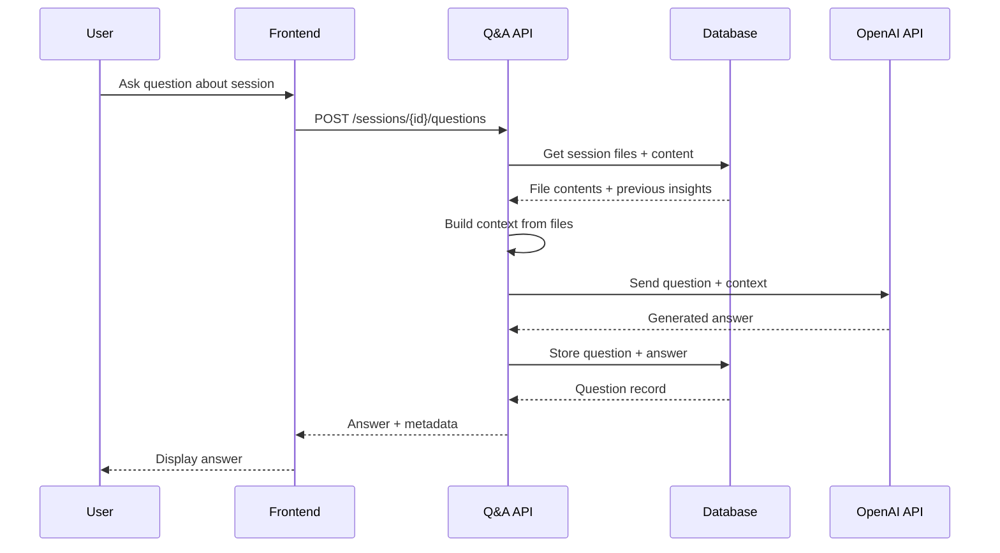
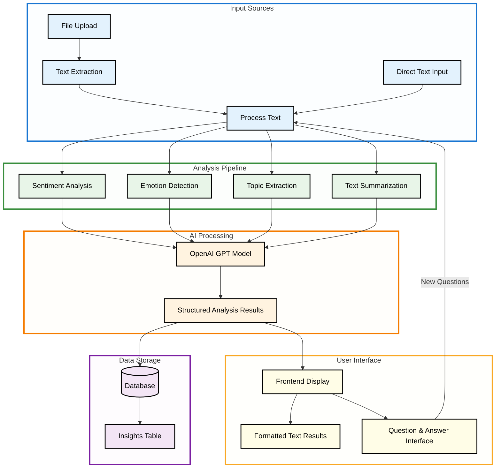

# DeepPurple Application Architecture Diagram

## Overview

This document provides a comprehensive architecture diagram for the DeepPurple text analysis platform, showing the complete tech stack from frontend to database with cloud services integration. The diagrams are designed to be easy to understand for beginners while providing valuable technical insights.

## System Architecture

### high-level-system-architecture-diagram.png

### software_architecture_diagram.png

### deployment_architecture_diagram.png

```mermaid
graph TB
    subgraph "Development Environment"
        subgraph "Docker Compose"
            ClientContainer["deeppurple-client<br/>Next.js Container<br/>Port 3000 → 80<br/>Nginx serving"]
            ServerContainer["deeppurple-server<br/>FastAPI Container<br/>Port 8000<br/>Uvicorn ASGI"]
        end

        LocalDB[("SQLite Database<br/>./deeppurple.db<br/>File-based storage")]
        LocalStorage["Local File System<br/>./uploads/<br/>Development mode"]
    end

    subgraph "Production Environment (AWS)"
        subgraph "Compute"
            EBS["AWS Elastic Beanstalk<br/>Auto-scaling web servers<br/>Load balancing<br/>Health monitoring"]
        end

        subgraph "Database"
            RDS["AWS RDS PostgreSQL<br/>Multi-AZ deployment<br/>Automated backups<br/>Connection pooling"]
        end

        subgraph "Storage & CDN"
            S3Bucket["AWS S3<br/>File storage<br/>Versioning<br/>Lifecycle policies"]
            CloudFront["CloudFront CDN<br/>Global distribution<br/>Edge caching"]
        end

        subgraph "Security & Monitoring"
            IAM["AWS IAM<br/>Role-based access<br/>Service permissions"]
            CloudWatch["CloudWatch<br/>Logging & monitoring<br/>Performance metrics"]
        end
    end

    subgraph "External APIs"
        OpenAIAPI["OpenAI API<br/>Text analysis<br/>Question answering<br/>Content generation"]
    end

    %% Development connections
    ClientContainer -.->|"API calls"| ServerContainer
    ServerContainer -.->|"SQLAlchemy ORM"| LocalDB
    ServerContainer -.->|"File I/O"| LocalStorage

    %% Production connections
    EBS -->|"Database queries"| RDS
    EBS -->|"File operations"| S3Bucket
    CloudFront -->|"Static assets"| S3Bucket
    EBS -->|"AI requests"| OpenAIAPI
    EBS -.->|"Logging"| CloudWatch

    %% Security
    IAM -.->|"Permissions"| EBS
    IAM -.->|"Permissions"| S3Bucket
```

## Technology Stack Breakdown

### Frontend Stack

- **Framework**: Next.js 15.3.2 with React 19
- **Language**: TypeScript 5+
- **Styling**: Tailwind CSS 4 with PostCSS
- **UI Components**: Radix UI primitives
- **Icons**: Lucide React
- **Forms**: React Hook Form with Zod validation
- **Charts**: Recharts for data visualization
- **HTTP Client**: Axios for API communication
- **Build Tool**: Turbopack (Next.js built-in)

### Backend Stack

- **Framework**: FastAPI 0.104.0
- **Language**: Python 3.10
- **ASGI Server**: Uvicorn 0.23.2
- **ORM**: SQLAlchemy 2.0.23
- **Authentication**: JWT with python-jose
- **Password Hashing**: bcrypt + passlib
- **Validation**: Pydantic 2.0+
- **File Processing**: PyPDF2, pandas, python-magic
- **AI Integration**: OpenAI API, LangChain
- **Cloud SDK**: boto3 for AWS services

### Database & Storage

- **Primary Database**: PostgreSQL (production), SQLite (development)
- **Connection Management**: SQLAlchemy connection pooling
- **File Storage**: AWS S3 (production), MinIO (development), Local FS (fallback)
- **Caching**: In-memory token blacklisting (Redis recommended for production)

### Infrastructure & DevOps

- **Containerization**: Docker with multi-stage builds
- **Orchestration**: Docker Compose (development), AWS ECS (production)
- **CI/CD**: GitHub Actions (assumed)
- **Monitoring**: AWS CloudWatch, application logging
- **Security**: AWS IAM, environment-based configuration

## Data Flow Diagrams

### User Authentication Flow

### File Upload & Analysis Flow

### Question Answering Flow

### high_level_data_flow_diagram.png (Text Analysis Process Flow)

## Security Architecture

### Authentication & Authorization

- **JWT Tokens**: HS256 algorithm with configurable expiration
- **Password Security**: bcrypt hashing with salt
- **Role-Based Access**: Admin vs regular user permissions
- **Token Blacklisting**: In-memory revocation (logout)
- **Session Isolation**: Users can only access their own data

### Data Protection

- **SQL Injection Prevention**: SQLAlchemy ORM with parameterized queries
- **File Upload Security**: MIME type validation, size limits
- **CORS Configuration**: Environment-specific origin restrictions
- **Input Validation**: Pydantic models with type checking
- **Error Handling**: Sanitized error messages

### Infrastructure Security

- **Environment Variables**: Sensitive data in .env files
- **AWS IAM**: Least privilege access policies
- **Database Encryption**: RDS encryption at rest
- **S3 Security**: Bucket policies and presigned URLs
- **Network Security**: VPC configuration (production)

## Performance Considerations

### Database Optimization

- **Connection Pooling**: 5 base connections, 10 overflow
- **Query Optimization**: Proper indexing on foreign keys
- **Connection Management**: Automatic cleanup and recycling
- **Migration Strategy**: Alembic for schema changes

### File Processing

- **Streaming Uploads**: Handle large files efficiently
- **Async Processing**: Non-blocking file operations
- **Content Caching**: Extracted text stored in database
- **Storage Tiers**: S3 lifecycle policies for cost optimization

### API Performance

- **Dependency Injection**: Efficient database session management
- **Response Caching**: Static asset optimization
- **Pagination**: Limit query results for large datasets
- **Error Handling**: Graceful degradation and retry logic

## Monitoring & Observability

### Application Logging

- **Structured Logging**: JSON format for CloudWatch
- **Log Levels**: Debug, Info, Warning, Error, Critical
- **Request Tracing**: API endpoint performance tracking
- **Error Tracking**: Exception capture and notification

### Metrics & Alerting

- **Response Time**: API endpoint latency monitoring
- **Error Rates**: 4xx/5xx response tracking
- **Database Performance**: Connection pool utilization
- **Storage Usage**: S3 bucket size and costs

### Health Checks

- **Container Health**: Docker healthcheck endpoints
- **Database Connectivity**: Connection pool status
- **External Dependencies**: OpenAI API availability
- **Storage Access**: S3 bucket accessibility

## Development Workflow

### Local Development

1. **Environment Setup**: Docker Compose with hot reload
2. **Database**: SQLite for simplicity, automatic migrations
3. **File Storage**: Local filesystem with uploads directory
4. **API Testing**: FastAPI automatic OpenAPI documentation

### Production Deployment

1. **Container Build**: Multi-stage Docker builds
2. **Infrastructure**: AWS ECS with RDS and S3
3. **Environment Variables**: Secure configuration management
4. **Database Migration**: Automated schema updates
